## Agile

まずはnmapの結果。  
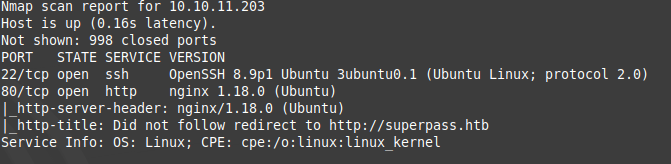

nmapの結果から、ドメイン`superpass.htb`にリダイレクトするとわかったので`/etc/hosts`に設定する。  

ブラウザから80番ポートにアクセスをする。  
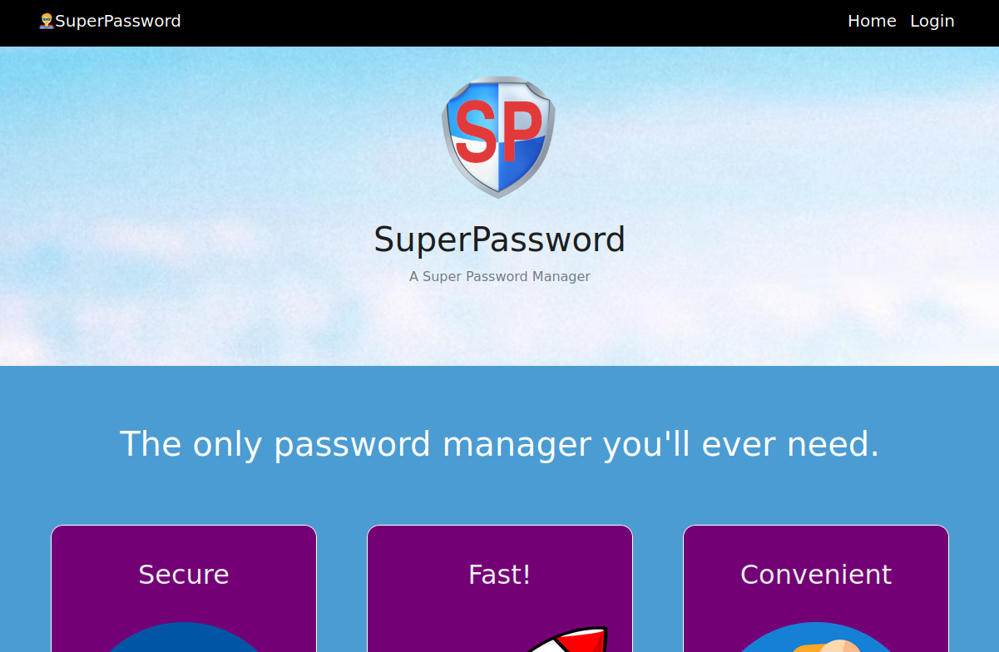

右上の『Login』に飛ぶ。  
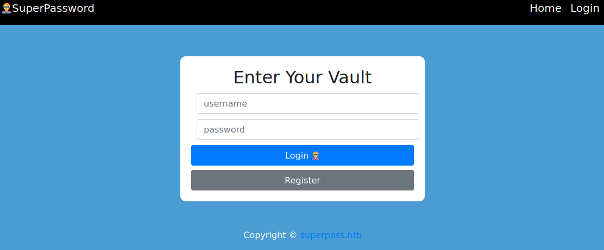

SQLmapを行うが欠陥がないようなので、正直に『Register』からアカウントを作成してみる。  

アカウントを作成しログインを行った。  
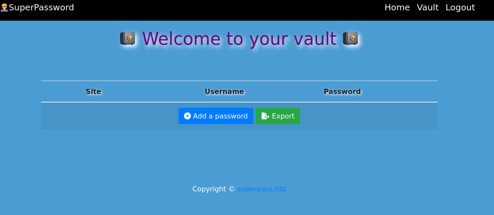

サイト名とユーザー名、ランダムなパスワードを保存しておける。  
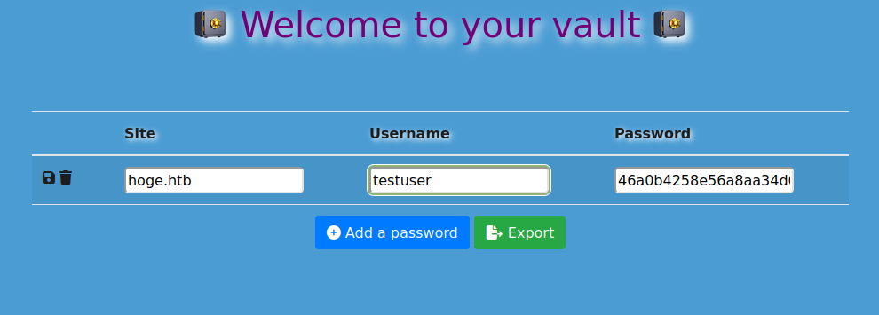  
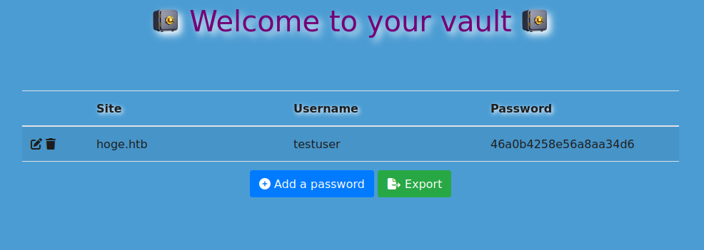

保存を行った後、『Export』から登録した情報をCSV形式でファイルをダウンロードできる。  
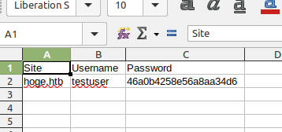

『Export』からファイルをダウンロードする命令の通信をBurp Suiteから見てみる。  
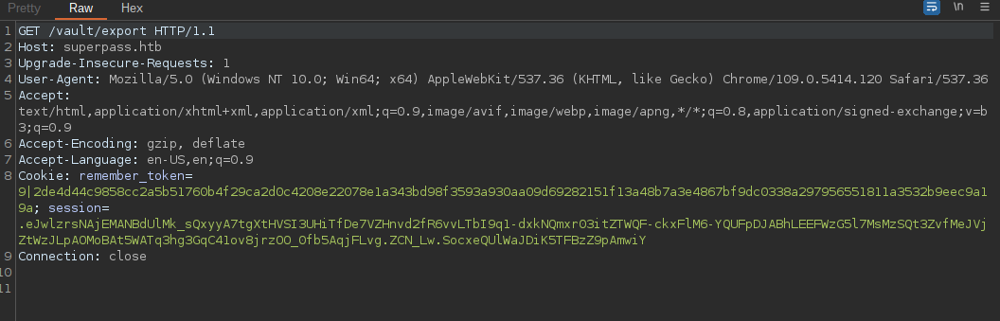  
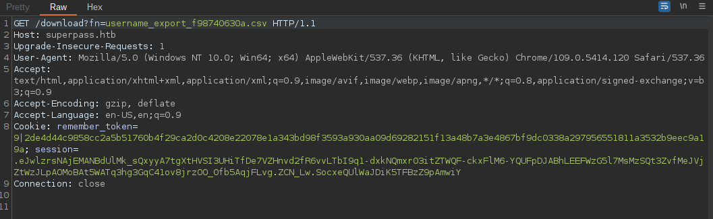

最初に`/vault/export`にGETを行い、リダイレクトで`/download?fn=<filename>`からCSVファイルをダウンロードした。  

`fn`パラメーターを使用しており、値にファイル名を指定している。  
ファイル名をローカルファイルの`/etc/passwd`を指定してみる。  
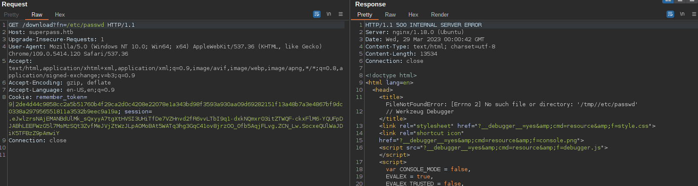

`FileNotFoundError`が発生し、`No such file or directory: '/tmp//etc/passwd'`と表示された。  
tmpディレクトリ内にいると予想、一つ上の階層を指定し/etc/passwdを指定する。  
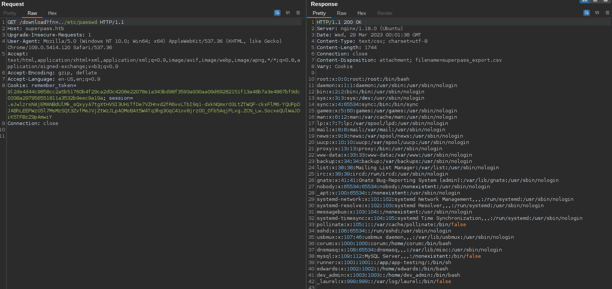

/etc/passwdの内容が漏れた。  

ここで、存在しないファイルを指定すると、  

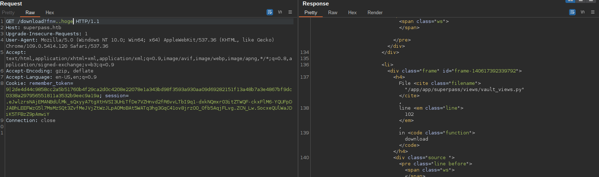

エラーの出力から本プログラムのパスがわかる。  

`/app/app/superpass/views/vault_views.py`だとわかったので、  
パストラバーサルで内容を見てみる。  

内容がこちら、  
```
import flask
import subprocess
from flask_login import login_required, current_user
from superpass.infrastructure.view_modifiers import response
import superpass.services.password_service as password_service
from superpass.services.utility_service import get_random
from superpass.data.password import Password


blueprint = flask.Blueprint('vault', __name__, template_folder='templates')


@blueprint.route('/vault')
@response(template_file='vault/vault.html')
@login_required
def vault():
    passwords = password_service.get_passwords_for_user(current_user.id)
    print(f'{passwords=}')
    return {'passwords': passwords}


@blueprint.get('/vault/add_row')
@response(template_file='vault/partials/password_row_editable.html')
@login_required
def add_row():
    p = Password()
    p.password = get_random(20)
    return {"p": p}


@blueprint.get('/vault/edit_row/<id>')
@response(template_file='vault/partials/password_row_editable.html')
@login_required
def get_edit_row(id):
    password = password_service.get_password_by_id(id, current_user.id)

    return {"p": password}


@blueprint.get('/vault/row/<id>')
@response(template_file='vault/partials/password_row.html')
@login_required
def get_row(id):
    password = password_service.get_password_by_id(id, current_user.id)

    return {"p": password}


@blueprint.post('/vault/add_row')
@login_required
def add_row_post():
    r = flask.request
    site = r.form.get('url', '').strip()
    username = r.form.get('username', '').strip()
    password = r.form.get('password', '').strip()

    if not (site or username or password):
        return ''

    p = password_service.add_password(site, username, password, current_user.id)
    return flask.render_template('vault/partials/password_row.html', p=p)


@blueprint.post('/vault/update/<id>')
@response(template_file='vault/partials/password_row.html')
@login_required
def update(id):
    r = flask.request
    site = r.form.get('url', '').strip()
    username = r.form.get('username', '').strip()
    password = r.form.get('password', '').strip()

    if not (site or username or password):
        flask.abort(500)

    p = password_service.update_password(id, site, username, password, current_user.id)

    return {"p": p}


@blueprint.delete('/vault/delete/<id>')
@login_required
def delete(id):
    password_service.delete_password(id, current_user.id)
    return ''


@blueprint.get('/vault/export')
@login_required
def export():
    if current_user.has_passwords:        
        fn = password_service.generate_csv(current_user)
        return flask.redirect(f'/download?fn={fn}', 302)
    return "No passwords for user"
    

@blueprint.get('/download')
@login_required
def download():
    r = flask.request
    fn = r.args.get('fn')
    with open(f'/tmp/{fn}', 'rb') as f:
        data = f.read()
    resp = flask.make_response(data)
    resp.headers['Content-Disposition'] = 'attachment; filename=superpass_export.csv'
    resp.mimetype = 'text/csv'
    return resp
```

40行目や49行目のコードに、IDOR(Insecure Direct Object Reference)の欠陥が存在する。  
`<id>`パラメーターで登録対象の指定をしており、ここの数値を変化させ他の人の登録内容を覗くことができる。  

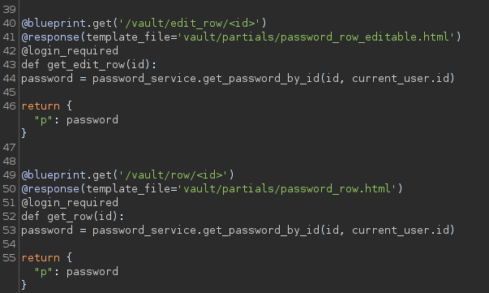

自分のIDは10であり、IDを10以外に変更し他人の登録情報を見る。  
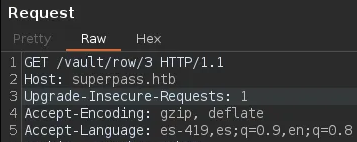

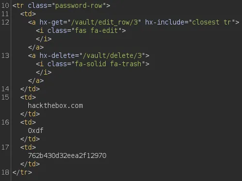

IDを変更して他人の登録情報を漏洩させていくと、  
サイト名が`agile`のが見つかり、`/etc/passwd`内から判明した`corum`ユーザーでSSHログインが可能になる。  
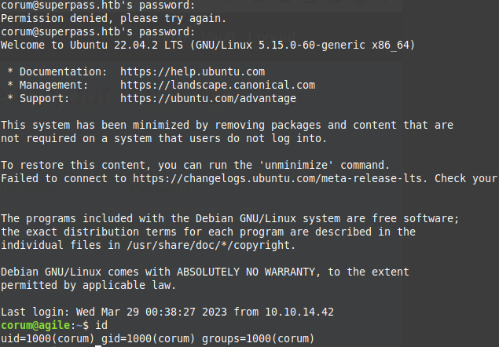


リッスンポートを調べると、`41829`番で何かしら稼働しているのがわかる。  
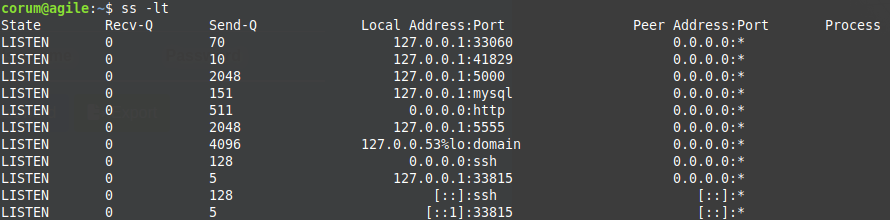  

何のサービスが稼働しているのか調べる。  
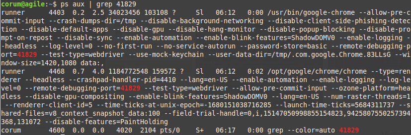

`--remote-debugging-port=41829`の引数でChromeデバッグが有効になっている。  
41829番ポートを介してリモートでChromeブラウザと相互作用し、別のコンピュータからChromeインスタンスに接続して、デバッグを行える。  

Chromeを起動し、`chrome://inspect/`からデバッグ対象を設定する。  
今回は41829番ポートで起動しているがリモートからこのポートに接続を行えないので、  
SSHのポートフォワード機能を使用しリモートからアクセスできるように行う。  
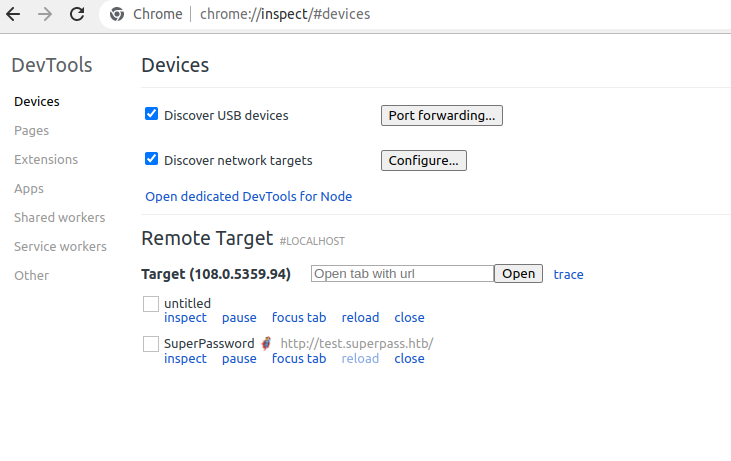
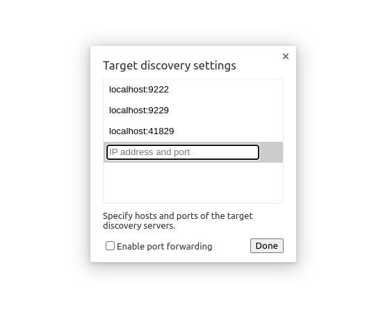

少し待つと、Remote Targetに対象が表示されるので『inspect』から対象のブラウザ画面を操作することができる。  
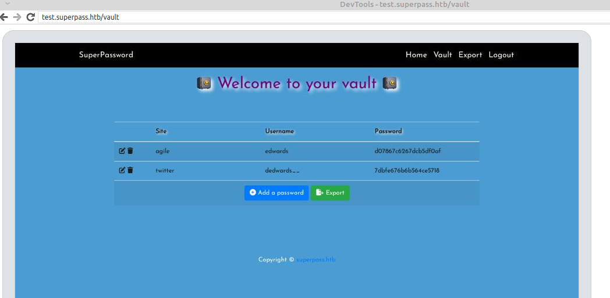

`test.superpass.htb/vault`にアクセスをしており登録しているパスワードがわかったので、  
この資格情報から`edwards`ユーザーにログインを行う。  
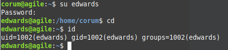

`sudo -l`を実行すると、`sudoedit`を`dev_admin`で実行できるのがわかった。  
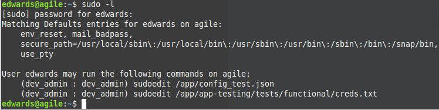

`/app/config_test.json`と`/app/app-testing/tests/functional/creds.txt`の内容は権限がなく見ることができない。  

`sudo -V`でバージョンを確認すると、`Sudo version 1.9.9`なのがわかった。  
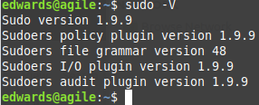

このバージョンは`CVE-2023–22809`の欠陥が存在する。  
`CVE-2023–22809`の内容は環境変数`EDITOR`に通常は編集エディタで何を使用するか設定されており、  
ここに"-"セパレーターを入れるとセパレーター以降を引数として処理してしまうという欠陥である。  
参考(https://nvd.nist.gov/vuln/detail/CVE-2023-22809)


今回は`dev_admin`の編集権限のあるファイルをなんでも書き換えることが可能になる。  

書き換えられるファイルを探す。  

`pspy`を実行するとUID=0、つまりroot権限で`/bin/bash /app/test_and_update.sh`を実行しているのがわかる。  
`/app/test_and_update.sh`の内容を見ると、Pythonの仮想環境を起動するスクリプトを実行しているのがわかった。  

偶然にも`dev_admin`ユーザーで編集することが可能だ。  
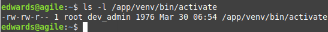

`CVE-2023-22809`を利用しEDITORに`export EDITOR='vim -- /app/venv/bin/activate'`を設定し、  
`sudo -u dev_admin sudoedit /app/config_test.json`を実行する。  

すると、欠陥により`/app/venv/bin/activate`が編集可能になるので、  
`chmod u+s /bin/bash`でrootのSUIDを付与するようにする。  
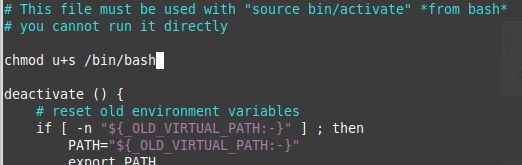

しばらくすると/bin/bashにrootのSUIDが付与されるので、  
`bash -p`で成り代わる。  
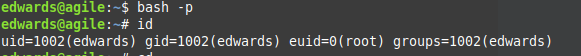


root フラグをゲットして終了。  

