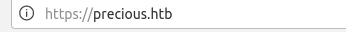

## Precious
IP: 10.10.11.189
Port: 22/tcp, 80/tcp
Domain: precious.htb
Sub Domain: no

nmapでポートスキャンを行う。

80番ポートが開いているので、ブラウザでアクセスを行う。

Locationヘッダーに`http://precious.htb/`がセットされており、
リダイレクトされるが、DNSに`precious.htb`に対応するIPアドレスが設定されていないため、
アクセスができない。
名前解決を行う順番は`/etc/nsswitch.conf`の`hosts:`に定義されており、
私の環境では、ファイル(/etc/hosts) -> mdns4 -> dnsという順番である。
`/etc/hosts`にドメイン`precious.htb`に対応するIPアドレス`10.10.11.189`を設定する。

