## machine: sau
## ip: 10.10.11.224

nmap
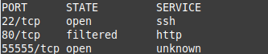  

80番ポートがopen|filteredであり、openなのかfilteredなのか判別できなかった。  
ブラウザからアクセスするとアクセスできなかった。  

55555番にアクセスを行う。  
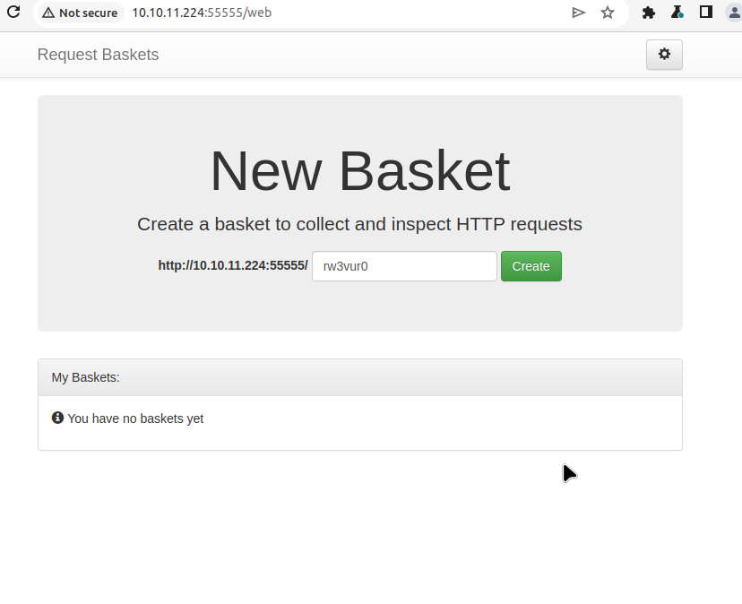

アクセスする度に、http://10.10.11.224:55555/ から先のURLがランダムに変わる。  
このWebサイト上では以下の[request-baskets](https://github.com/darklynx/request-baskets)というwebhook.siteのようなHTTPリクエストを収集することができる。  
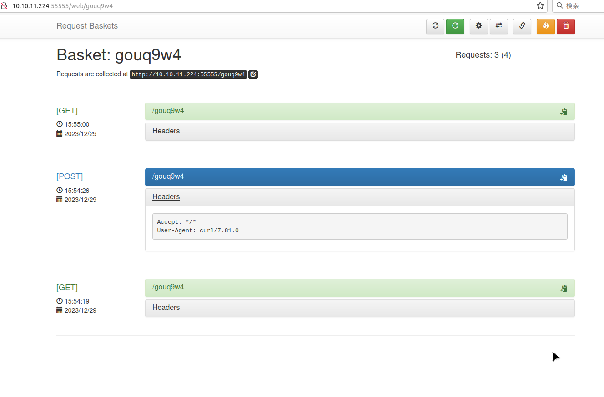  

機能としては、HTTPリクエストの収集、HTTPリクエストに対しての構成可能なレスポンス、転送など...  
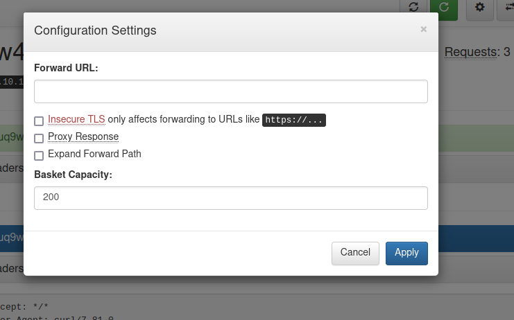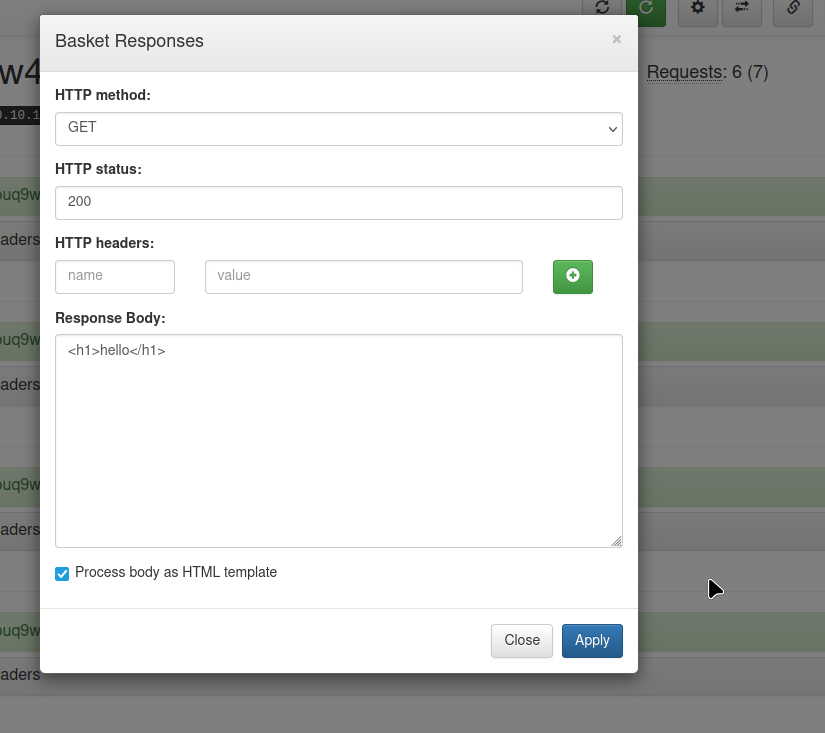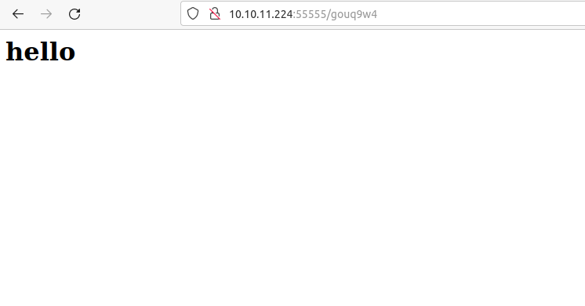  

一通り機能を試した後に現在のバージョンに悪用可能な脆弱性が存在しないか調べる。  
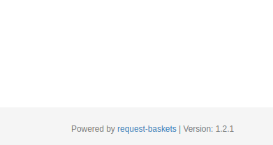  

すると、CVE-2023-27163の脆弱性が見つかっているみたい。  
https://medium.com/@li_allouche/request-baskets-1-2-1-server-side-request-forgery-cve-2023-27163-2bab94f201f7

SSRFの欠陥で、エンドポイントは転送処理の箇所。  
せっかくなので、1.2.1のソースコードを見て実際にどのような処理がされているのか見てみる。  
コードを見たところ、SSRFに対する対策が見当たらなかった。  
以下は転送URLへのリクエスト処理の箇所↓  
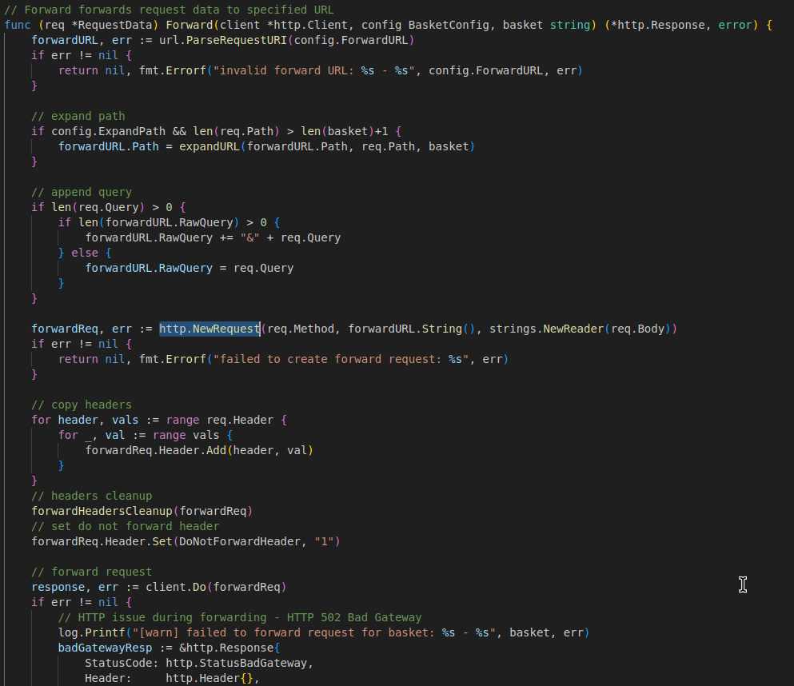  


これを利用してアクセスできなかった80番ポートへのアクセスを試みる。  
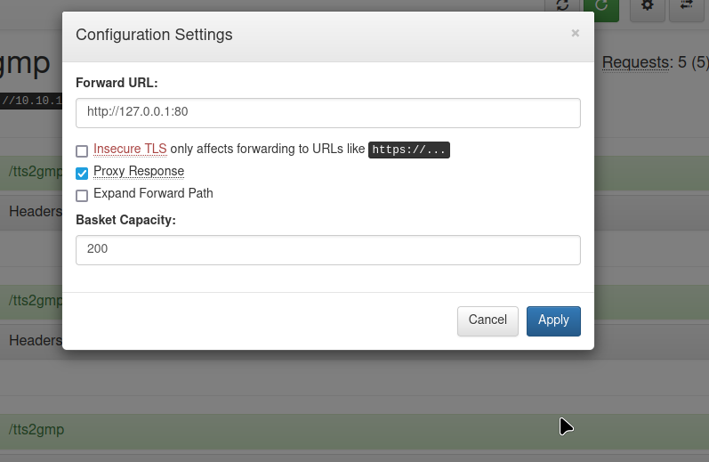  
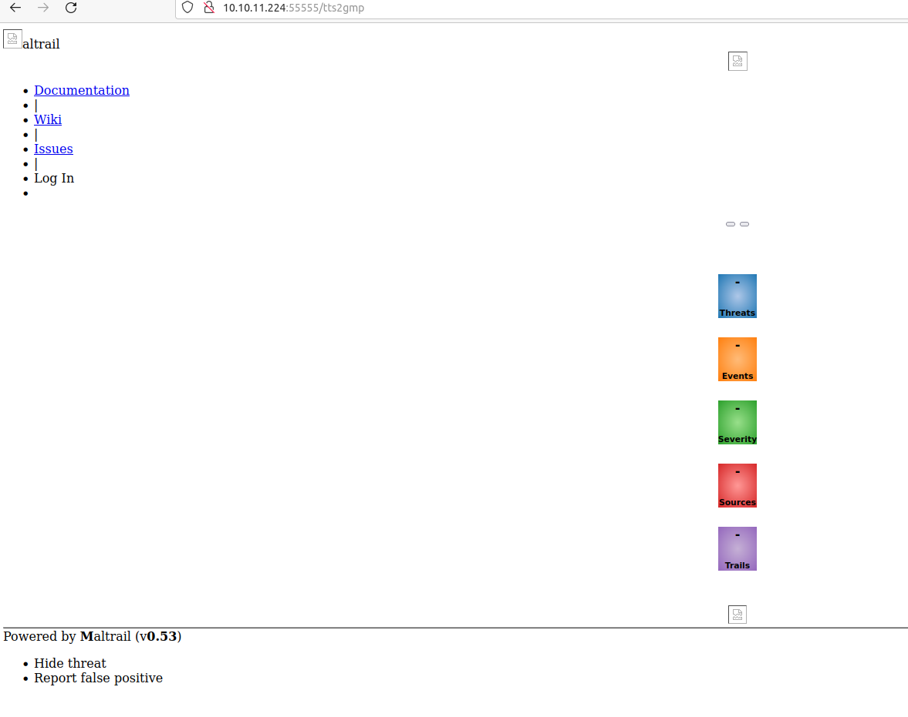  

すると、CSSのないページが表示された。  
とりあえず辺をぽちぽち押してみるが何もない。  

下に「Maltrail(v0.53)」とあるのでこれもバージョン調べをする。  
ちなみにMaltrailはトラフィック検出システムで悪意のあるHTTPリクエストを検出できるのだそう...。  

調べると、ログインページにOSコマンドインジェクションの欠陥があるみたい。  
外部から送られてきたusernameパラメータの値をそのままsubprocess.check_output()に流しているみたい。  
これもMaltrailのソースコードを確認してみる。  

```
subprocess.check_output("logger -p auth.info -t \"%s[%d]\" \"%s password for %s from %s port %s\"" % (NAME.lower(), os.getpid(), "Accepted" if valid else "Failed", params.get("username"), self.client_address[0], self.client_address[1]), stderr=subprocess.STDOUT, shell=True)

```

このように、usernameパラメータで送られてきた値をサニタイズすることなくsubprocess.check_output()に渡していた。  
この欠陥を利用して、OSコマンドを実行する。  
攻撃ペイロードは転がっていたコードを使わせていただく。  

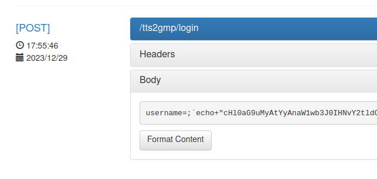  

権限昇格することなく、user flagをゲット  
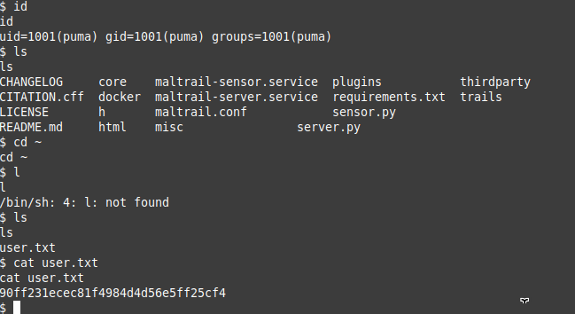  

HTB定番の一つ、`sudo -l`を実行  
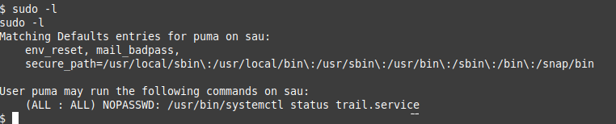  

今回もこのパターンらしい。  
systemctlコマンドをroot権限で実行できるということなので、[GTFOBins](https://gtfobins.github.io/)で悪用できないか調べる。  
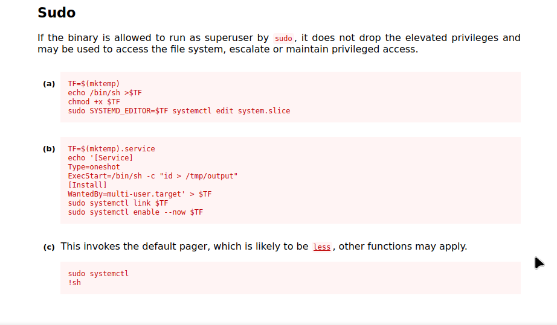  

`sudo systemctl`を実行した後に、`!sh`を実行したらその時に実行した権限でシェルを起動できるみたい。  

これを使ってroot flagをゲット
