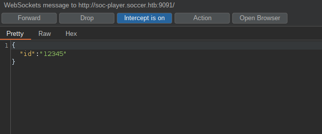
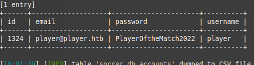

## Soccer
nmapの結果がこちら  
```
22/tcp  open    ssh     OpenSSH 8.2p1 Ubuntu
80/tcp  open    http    nginx 1.18.0
9091/tcp    open 
```

80番ポートをブラウザからアクセスする  


IPとドメインを対応付ける設定をして再度アクセス。  


ソースコードを覗いたり、レスポンスを見たりしたが何もないので、  
`ffuf`でディレクトリ、ファイルを列挙する。  

`/tiny`ディレクトリを発見し、アクセスする。  


`Tiny File Manager`が開いた。  
`Tiny File Manager`について調べるとGithubリポジトリがあり、  
デフォルトのパスワードがあるみたい。  
```
Default username/password: admin/admin@123 and user/12345.
```
Github(https://github.com/prasathmani/tinyfilemanager)

ログインを行うとwebサーバーの公開ディレクトリの管理画面らしきものを操作できるみたい。  


`/tiny/uploads`にファイルをアップロードしてwebに公開することができるらしい。  
PHPファイルをアップロードしてリバースシェルを獲得する。  
  


`netstat`で待ち受け状態のポートを調べる。  


nmapでポートスキャンを行った際、9091番が待ち受け状態になっていた。  
ブラウザからアクセスを行うと、`Cannot GET /`と表示されPOSTリクエストでは`Cannot POST /`とレスポンスが来る。  
この正体を調べていると、`/etc/nginx/sites-enabled`にサブドメインが存在するのがわかった。  
最初の調査段階にて`ffuf`を使用し、サブドメインの列挙を行ったが検出されなかったため、  
他のサブドメインが存在しないものと思っていた。  


`soc-player.soccer.htb`とIPアドレスを対応付けアクセスを行う。  


メニュー欄に`Signup`と`Login`など追加されており、アカウントを作成できるようになっている。  
アカウントを作成し何ができるのかを調べると、ticket numberを入力し照合を行っているみたいだ。  


ソースコードを確認すると、`WebSocket`を使用し`id`パラメータを送信しているのがわかった。  



idパラメータを送信し、照合しているという点から`SQL Injection`を想像する。  
`sqlmap`を使用し調査を行いたいが、直接WebSocketのURIを指定して実行ができない。  
調べるとWebSocket上でもsqlmapを実行できるコードを公開している記事がある。  
(https://rayhan0x01.github.io/ctf/2021/04/02/blind-sqli-over-websocket-automation.html)

以下のように編集をし、実行する。  


プロキシのような役割をしており、httpリクエストをWebSocketで送ってくれる。  
`sqlmap`を実行した結果、`time-based blind`の欠陥があるのがわかった。  


データベース名やテーブルの内容をダンプをし、`password`がわかる。  


この情報でSSHに接続が可能。  
権限昇格の定番、`SUID`が付与されているファイルを列挙する。  


一番上に`doas`というものが検出される。  
調べると、コマンドを別のユーザーで実行することができるらしい。  
`sudo`コマンドと似ている。  
権限昇格に繋がる欠陥やマニュアルを調べると、`plugin`を作成し読み込ませられるらしい。  
doasにはSUIDでroot権限が付与されているので、root権限でファイルを実行できる。  


```
~/.dstat/
(path to binary)/plugins/
/usr/share/dstat/
/use/local/share/dstat/
```
以下のどれかに`dstat_*.py`形式でリバースシェルコードを設置しdoasを実行する。  


リバースシェルを獲得し、rootフラグをゲットできる。  
