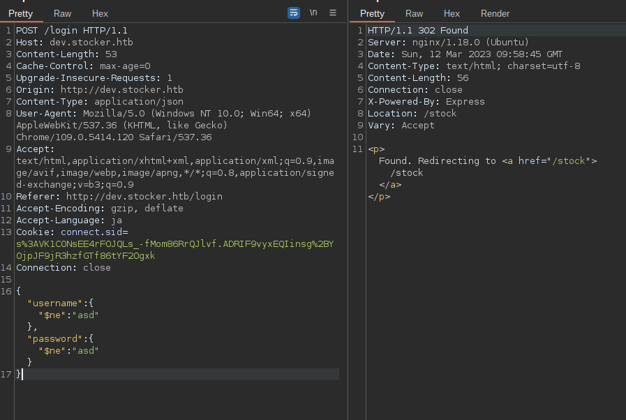

## Stocker

nmapする。  


ブラウザから80番にアクセスする。  


`/etc/hosts`にIPアドレスとホスト名を対応付ける設定を行い、再度アクセス。  


ソースコードを確認すると、`Eleventy`という静的サイトジェネレーターを使用して作られたページだとわかる。  
(今回の問題では必要のない情報である)  


一通りボタンをポチポチ押しても有益なページや情報がない、  
`ffuf`を使用してサブドメインを列挙する。　　
]

`dev`というサブドメインが検出される。  
`dev.stocker.htb`をhostsファイルに設定し、アクセス。  


ログイン画面が表示される。  
他に悪用できそうな情報やページがないことから、このログイン画面を突破口とする。  


`sqlmap`を使用したが検出されない。  
`Content-Type`をいじったところ、JSONを扱うようなエラーメッセージが返された。  


JSONを扱っているとこから、`NoSQL`を使用していると予想する。  
NoSQLのInjection攻撃を調べると、`$ne`演算子を使用したパラメータを送ると認証を突破できるみたいです。   
(https://nullsweep.com/nosql-injection-cheatsheet/)  
`$ne`演算子は"not equal"(等しくない)を表し、$ne演算子を使用してクエリを作成すると、  
指定されたフィールドの値が、指定された値と異なるすべてのオブジェクトが返されるというものです。  
次のようなクエリを送ります。  


認証を通過し、ショップ画面のようなものが表示されます。  


商品の『Add to Basket』を押すとカートに追加され、  
『View Cart』でカートの中身を表示できます。  


『Submit Purchase』で送信すると、購入完了画面が表示されます。  


リンクをクリックすると、送信した注文情報がPDFに変換されダウンロードが可能になります。  


PDFファイルをダウンロードし、`string`コマンドで表示可能な文字列を見ます。  
すると、"Skia/PDF m108"というGoogleが開発したオープンソースのライブラリであり、  
レンダリング後、PDFやXPSで出力することが可能というものだ。  
既知の欠陥がないか調べると、XSS to SSRFの欠陥があるのがわかった。  
XSSペイロードをサーバー上で実行しているため、`<iframe>`タグを使用し内部ファイルを見ることができる。  
<iframe>タグを使用し、nginxの設定ファイルを見てみる。  


サブドメイン`dev`のドキュメントルートが`/var/www/dev`だということがわかった。  
この箇所で苦戦し、どのファイルを覗けばいいかわからなくなる。  
調べるとNodeJSの命名規則に従って`index.js`や`app.js`を見たらいいらしい。  
以下のようなペイロードを送信し覗く。  
```
<iframe src=file:///var/www/dev/index.js height=1050px width=900px</iframe>
```


`index.js`にDBの認証情報が書かれている。  
認証情報の使い回しを予想して、SSHを接続を試みるが失敗。  
`/etc/passwd`ファイルからユーザー名を調べる。  


`angoose`というユーザーが存在し、DBの認証情報を使用してログインが成功する。  
user フラグを獲得。  

権限昇格を行う。  
定番の`sudo -l`を実行すると、NodeJSが実行され対象ファイルにワイルドカードが使用されている。  


`/usr/local/scripts`配下に書き込み権限がないので、ファイルパスをいじりホームディレクトリ配下を指定する。  
jsファイルにはリバースシェルを獲得するコードを書く。  
```
sudo /usr/bin/node /usr/local/scripts/../../../home/angoose/hoge.js
```

root権限のリバースシェルを獲得し、rootフラグをゲットして終わり。  

