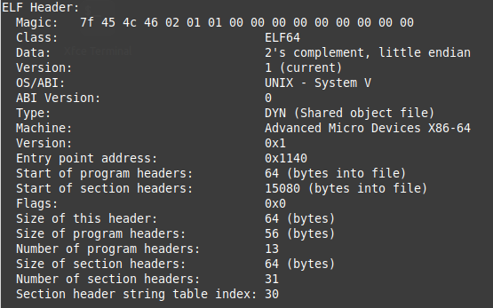
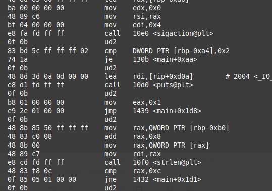
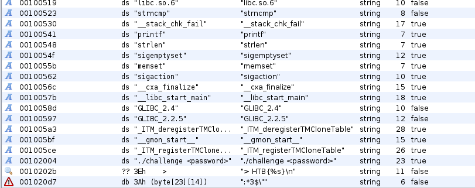
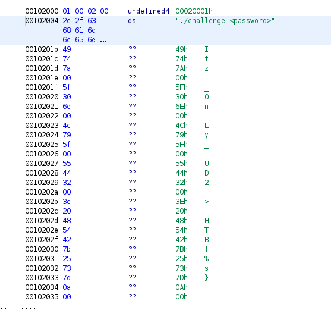

## Behind the Scenes

問題文がこれ  
```
After struggling to secure our secret strings for a long time, we finally figured out the solution to our problem: Make decompilation harder. It should now be impossible to figure out how our programs work! 
```

逆コンパイルを困難にしているらしい。  
とりあえず`file`コマンドの結果がこれ  
```
behindthescenes: ELF 64-bit LSB shared object, x86-64, version 1 (SYSV), dynamically linked, interpreter /lib64/ld-linux-x86-64.so.2, BuildID[sha1]=e60ae4c886619b869178148afd12d0a5428bfe18, for GNU/Linux 3.2.0, not stripped
```

次に`readelf`を見てみる。  


Entry pointは`0x1140`

次にGhidraでmain関数を逆コンパイルする。  
```
void main(void)

{
  long in_FS_OFFSET;
  sigaction local_a8;
  undefined8 local_10;
  
  local_10 = *(undefined8 *)(in_FS_OFFSET + 0x28);
  memset(&local_a8,0,0x98);
  sigemptyset(&local_a8.sa_mask);
  local_a8.__sigaction_handler.sa_handler = segill_sigaction;
  local_a8.sa_flags = 4;
  sigaction(4,&local_a8,(sigaction *)0x0);
  do {
    invalidInstructionException();
  } while( true );
}
```

解析を困難にするという処理はここで行われている。  
シグナルハンドラ関数である`segill_sigaction`関数を使用して`invalidInstructionException`関数で例外を発生させている。  

プログラムを実際に動かしてみると、  
```
./challenge <password>
```
と表示される。  
引数に適当に入力しプログラムを動かすと何も表示されず終了する。  
これはpasswordが間違っているのではなく先ほどの例外が発生し強制的に終了しているのだと予想する。  

次に`objdump`で解析してみる。  
main関数の一部がこちら  


`ud2`という見慣れないアセンブリ命令がある。  
調べるとこれは、無効なオペコード例外を発生させるものらしい。  
バッファオーバーフロー攻撃からプログラムを保護するためにプログラムの未定義の領域にUD2命令を配置したりするらしい。  
今回はud2命令を使用して解析を困難にしている。  

ghidraでプログラム実行時に渡す引数がどのように使用されているのか調べるため、  
search for string機能を使用し、`./challenge <password>`の文字列を検索する。  


アドレス`0x00102004`で使用されているみたいなので飛んでみる。  


Flagが見つかった。  
これが正しい見つけ方なのかどうかはわからないが、見つかったのでヨシ。
