## Exatlon

`readelf`の結果こちら  
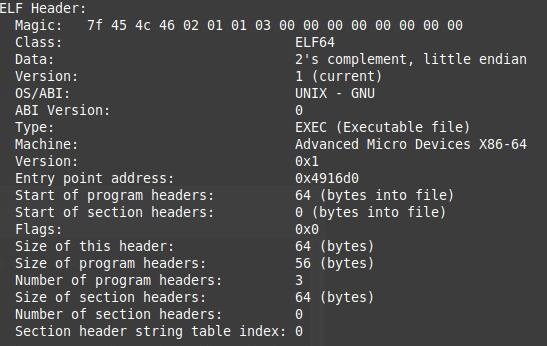

`file`コマンドの結果  
```
exatlon_v1: ELF 64-bit LSB executable, x86-64, version 1 (GNU/Linux), statically linked, no section header
```

`objdump`コマンドの結果  
```
exatlon_v1:     file format elf64-x86-64
```
あれ...これだけ？  

`string`コマンドで確認したらUPX、つまり実行ファイルが実行可能な状態で圧縮されていた。  
これにより元のプログラム構造やデータがわからなくなる。  
参考(https://xtech.nikkei.com/atcl/nxt/mag/nnw/18/111900071/052100019/)

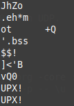

UPXでpackingされたファイルは`upx`コマンドで簡単にunpackingが可能だ。  
unpackingしたファイルを再度`readelf`と`r2`で見てみる。  
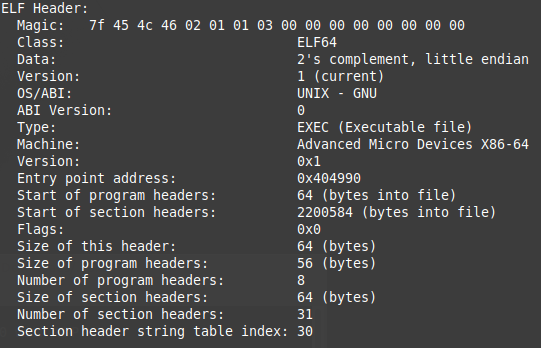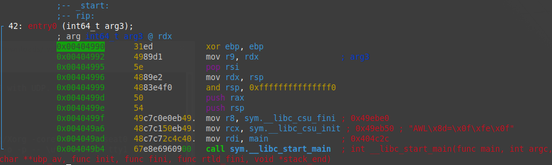

unpackingしたバイナリを実行する。  
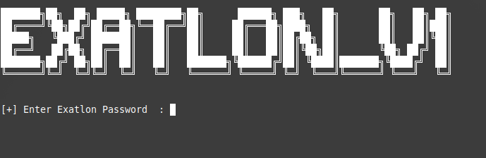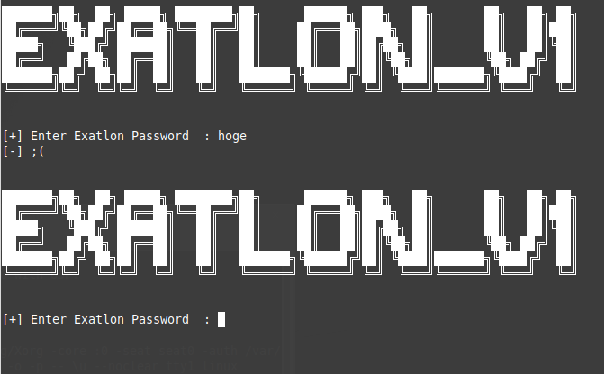

`[+] Enter Exatlon Password`と表示され、入力を行う。  
何かと比較をしており、違う場合には再度入力を求められる。  

次にGhidraで静的解析を行う。  
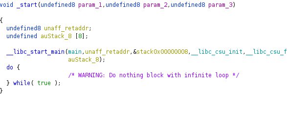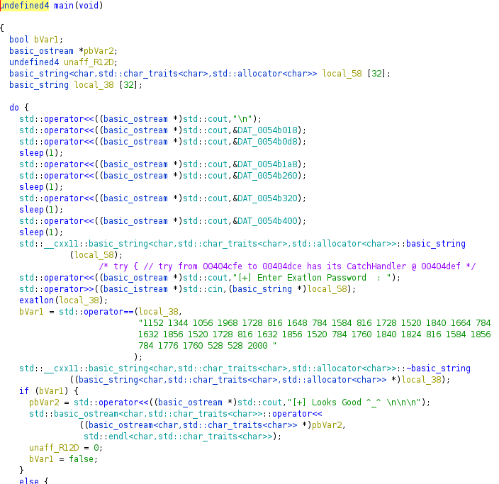

注目すべき箇所はここ。  
```
    exatlon(local_38);
    bVar1 = std::operator==(local_38,
                            "1152 1344 1056 1968 1728 816 1648 784 1584 816 1728 1520 1840 1664 784  1632 1856 1520 1728 816 1632 1856 1520 784 1760 1840 1824 816 1584 1856  784 1776 1760 528 528 2000 "
                           };
```

local_38が入力した値が格納されている。  
exatlon関数の内容がこちら  
```
basic_string * exatlon(basic_string *param_1)

{
  bool bVar1;
  char *pcVar2;
  basic_string<char,std::char_traits<char>,std::allocator<char>> *in_RSI;
  undefined8 local_80;
  undefined8 local_78;
  allocator<char> local_69;
  basic_string local_68 [32];
  __cxx11 local_48 [39];
  char local_21;
  basic_string<char,std::char_traits<char>,std::allocator<char>> *local_20;
  
  std::allocator<char>::allocator();
                    /* try { // try from 00404ae8 to 00404aec has its CatchHandler @ 00404bc1 */
  std::__cxx11::basic_string<char,std::char_traits<char>,std::allocator<char>>::basic_string
            ((char *)param_1,(allocator *)&DAT_0054b00c);
  std::allocator<char>::~allocator(&local_69);
  local_20 = in_RSI;
  local_78 = std::__cxx11::basic_string<char,std::char_traits<char>,std::allocator<char>>::begin
                       (in_RSI);
  local_80 = std::__cxx11::basic_string<char,std::char_traits<char>,std::allocator<char>>::end
                       (local_20);
  while( true ) {
    bVar1 = __gnu_cxx::operator!=((__normal_iterator *)&local_78,(__normal_iterator *)&local_80);
    if (!bVar1) break;
    pcVar2 = (char *)__gnu_cxx::
                     __normal_iterator<char_const*,std::__cxx11::basic_string<char,std::char_traits< char>,std::allocator<char>>>
                     ::operator*((__normal_iterator<char_const*,std::__cxx11::basic_string<char,std: :char_traits<char>,std::allocator<char>>>
                                  *)&local_78);
    local_21 = *pcVar2;
                    /* try { // try from 00404b63 to 00404b67 has its CatchHandler @ 00404bfd */
    std::__cxx11::to_string(local_48,(int)local_21 << 4);
                    /* try { // try from 00404b7d to 00404b81 has its CatchHandler @ 00404bec */
    std::operator+(local_68,(char *)local_48);
                    /* try { // try from 00404b93 to 00404b97 has its CatchHandler @ 00404bdb */
    std::__cxx11::basic_string<char,std::char_traits<char>,std::allocator<char>>::operator+=
              ((basic_string<char,std::char_traits<char>,std::allocator<char>> *)param_1,local_68);
    std::__cxx11::basic_string<char,std::char_traits<char>,std::allocator<char>>::~basic_string
              ((basic_string<char,std::char_traits<char>,std::allocator<char>> *)local_68);
    std::__cxx11::basic_string<char,std::char_traits<char>,std::allocator<char>>::~basic_string
              ((basic_string<char,std::char_traits<char>,std::allocator<char>> *)local_48);
    __gnu_cxx::
    __normal_iterator<char_const*,std::__cxx11::basic_string<char,std::char_traits<char>,std::alloca tor<char>>>
    ::operator++((__normal_iterator<char_const*,std::__cxx11::basic_string<char,std::char_traits<cha r>,std::allocator<char>>>
                  *)&local_78);
  }
  return param_1;
}
```

exatlon関数は入力された値を引数として渡し一文字ずつ16進変換を行い左へ4つシフトを行った値をreturnしている。  
その値と`"1152 1344 1056 1968 1728 816 1648 784 1584 816 1728 1520 1840 1664 784  1632 1856 1520 1728 816 1632 1856 1520 784 1760 1840 1824 816 1584 1856  784 1776 1760 528 528 2000 "`とを比較している。  

次にgdbで動的解析を行う。  
Entry pointは`0x404990`であり、main()関数のアドレスは`0x404c2c`である。  
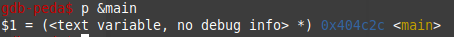

gdbで解析を行う際に問題の箇所で一時停止を行いたいので、ghidraで問題箇所のアドレスを調べbreak pointを設定する。  
入力を行っている、  
```
std::operator<<((basic_ostream *)std::cout,"[+] Enter Exatlon Password  : ");
```
のアドレスは`0x00404cfe`にあり、  exatlon関数は`0x00404d16`、比較は`0x00404d37`に存在する。  
今回の問題は入力された値がどのように変換処理が行われ、`"1152 1344 1056 1968 1728 816 1648 784 1584 816 1728 1520 1840 1664 784  1632 1856 1520 1728 816 1632 1856 1520 784 1760 1840 1824 816 1584 1856  784 1776 1760 528 528 2000 "`と比較しているのかを調べたいので、比較箇所にbreak pointを設定し、レジスタの状態を確認する。  

「A」を入力した場合は`1040`になり、「B」を入力した場合は`1056`となり16ずつ値が増えていく。これは「A」のUnicode番号である65を右シフトした値である。  
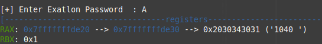
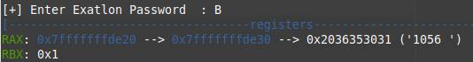
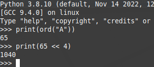

同じく小文字の場合や記号を調べる。  
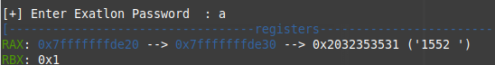
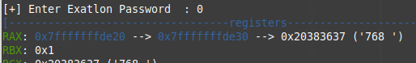
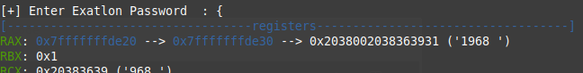


以上の結果から、pythonを使用し答えを表示する。  
```
import string

x = "1152 1344 1056 1968 1728 816 1648 784 1584 816 1728 1520 1840 1664 784  1632 1856 1520 1728 816 1632 1856 1520 784 1760 1840 1824 816 1584 1856  784 1776 1760 528 528 2000"
alphabet_letters = [char for char in string.ascii_letters]
alphabet_uppercase = [char for char in string.ascii_uppercase]
digits = [char for char in string.digits]

d = {}

def main():
    cnt = 1552
    for i in alphabet_letters:
        d[i] = cnt
        cnt += 16
    
    cnt = 1040
    for i in alphabet_uppercase:
        d[i] = cnt
        cnt += 16
    
    cnt = 768
    for i in digits:
        d[i] = cnt
        cnt += 16
    
    d["{"] = 1968
    d["}"] = 2000
    d["!"] = 528
    d["_"] = 1520

    x_list = x.split()
    for i in x_list:
        for k, v in d.items():
            if v == int(i):
                print(k, end="")
    
    print()
    
if __name__ == "__main__":
    main()
```

Flagが表示され、答えがわかる。  
長いプログラムになってしまったが、16進に変換して右シフト4しているだけなのでコードをコンパクトにできるのを後から気づいた。  

```
x = "1152 1344 1056 1968 1728 816 1648 784 1584 816 1728 1520 1840 1664 784  1632 1856 1520 1728 816 1632 1856 1520 784 1760 1840 1824 816 1584 1856  784 1776 1760 528 528 2000"

x_list = x.split()

for i in x_list:
    print(chr(int(i) >> 4), end="")
```


