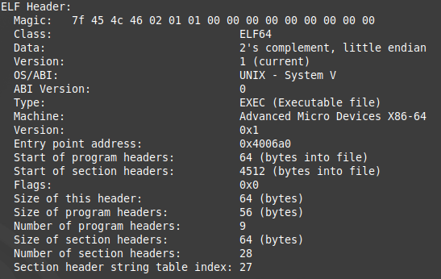
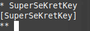
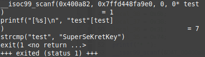
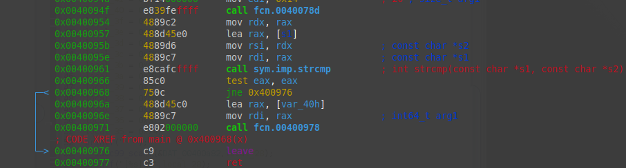
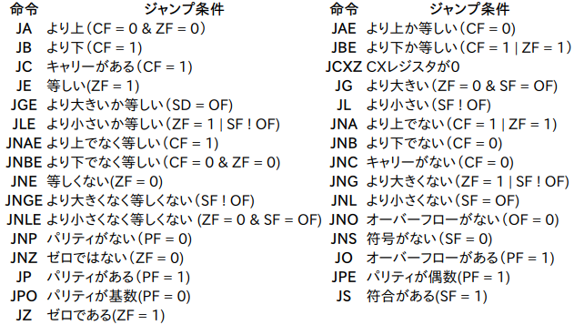
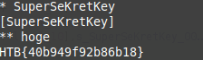

## Impossible Password
※復習のため基本も記述します。  

pwn問やrev問では、私は最初に`file`コマンドや`readelf`、`nm`を実行する。  
以下は、`file`の結果である。  
```
impossible_password.bin: ELF 64-bit LSB executable, x86-64, version 1 (SYSV), dynamically linked, interpreter /lib64/ld-linux-x86-64.so.2, for GNU/Linux 2.6.32, BuildID[sha1]=ba116ba1912a8c3779ddeb579404e2fdf34b1568, stripped
```

`readelf`の結果の一部がこれ  


これらの情報から64bitのバイナリであり、`Entry point address`が`0x4006a0`だということがわかる。  

main関数をGhidraで静的解析した結果がこちら  
```
void FUN_0040085d(void)

{
  int iVar1;
  char *__s2;
  undefined local_48;
  undefined local_47;
  undefined local_46;
  undefined local_45;
  undefined local_44;
  undefined local_43;
  undefined local_42;
  undefined local_41;
  undefined local_40;
  undefined local_3f;
  undefined local_3e;
  undefined local_3d;
  undefined local_3c;
  undefined local_3b;
  undefined local_3a;
  undefined local_39;
  undefined local_38;
  undefined local_37;
  undefined local_36;
  undefined local_35;
  char local_28 [20];
  int local_14;
  char *local_10;
  
  local_10 = "SuperSeKretKey";
  local_48 = 0x41;
  local_47 = 0x5d;
  local_46 = 0x4b;
  local_45 = 0x72;
  local_44 = 0x3d;
  local_43 = 0x39;
  local_42 = 0x6b;
  local_41 = 0x30;
  local_40 = 0x3d;
  local_3f = 0x30;
  local_3e = 0x6f;
  local_3d = 0x30;
  local_3c = 0x3b;
  local_3b = 0x6b;
  local_3a = 0x31;
  local_39 = 0x3f;
  local_38 = 0x6b;
  local_37 = 0x38;
  local_36 = 0x31;
  local_35 = 0x74;
  printf("* ");
  __isoc99_scanf(&DAT_00400a82,local_28);
  printf("[%s]\n",local_28);
  local_14 = strcmp(local_28,local_10);
  if (local_14 != 0) {
                    /* WARNING: Subroutine does not return */
    exit(1);
  }
  printf("** ");
  __isoc99_scanf(&DAT_00400a82,local_28);
  __s2 = (char *)FUN_0040078d(0x14);
  iVar1 = strcmp(local_28,__s2);
  if (iVar1 == 0) {
    FUN_00400978(&local_48);
  }
  return;
}
```

`__isoc99_scanf()`で入力を受け付け`local_28`変数に格納後local_10の値と比較し違った場合は`exit()`し同じ場合は進むというようになっている。  
`local_10`の値は何か確認すると、`local_10 = "SuperSeKretKey";`と`SuperSeKretKey`という文字列で比較している。  

なので、プログラム実行後`SuperSeKretKey`で最初の比較を通過する。  


`ltrace`コマンドでも、何と比較しているのかを確認することができる。  


次は以下の部分を見ていく。  
```
printf("** ");
  __isoc99_scanf(&DAT_00400a82,local_28);
  __s2 = (char *)FUN_0040078d(0x14);
  iVar1 = strcmp(local_28,__s2);
  if (iVar1 == 0) {
    FUN_00400978(&local_48);
  }
```
`__isoc99_scanf()`で入力を受け取り`local_28`に格納、`FUN_0040078d()`に`0x14`を渡し結果を`__s2`に格納、`strcmp()`で`local_28`と`__s2`を比較、同じであれば`FUN_00400978()`関数に入る。  

まずは`FUN_0040078d`を見る。  
```
void * FUN_0040078d(int param_1)

{
  int iVar1;
  time_t tVar2;
  void *pvVar3;
  int local_c;
  
  tVar2 = time((time_t *)0x0);
  DAT_00601074 = DAT_00601074 + 1;
  srand(DAT_00601074 + (int)tVar2 * param_1);
  pvVar3 = malloc((long)(param_1 + 1));
  if (pvVar3 != (void *)0x0) {
    for (local_c = 0; local_c < param_1; local_c = local_c + 1) {
      iVar1 = rand();
      *(char *)((long)local_c + (long)pvVar3) = (char)(iVar1 % 0x5e) + '!';
    }
    *(undefined *)((long)pvVar3 + (long)param_1) = 0;
    return pvVar3;
  }
                    /* WARNING: Subroutine does not return */
  exit(1);
}
```
プログラムの流れ  
1. 現在の時刻を取得し`tVar2`変数に格納
2. `DAT_00601074`に1を加算
3. `DAT_00601074`に`(int)tVar2 * param_1`を足した値をseed値として、srand()を初期化
4. `param1 + 1`バイト分のメモリを`malloc`で割り当てる
5. ASCIIコード表で`!`から`0x5e`未満のランダムな文字で一文字ずつ埋める
6. 作成した文字列のポインタを返す

srand()に渡しているseed値の値はシステム時刻を使用している。  
同じseed値からは同じランダムな値が生成されるため、システム時刻をいじるのがいいがもっと簡単な方法で解決していきたい。  それは`radare2`でバイナリ編集しif文を消す方法でやる。  

radare2で解析した結果がこれ  


cの`if (iVar1 == 0) {`はアセンブリの`test eax, eax`と`jne 0x400976`に対応している。  
`strcmp`で先ほどランダム生成した文字列と入力した文字列とを比較し同じであれば1を`eax`レジスタに格納、オペコード`test`を使用し2つのオペランドの論理積を計算し、結果がゼロならゼロフラグ(ZF)を立てる。  
`jne 0x400976`によりゼロフラグに1が立っていなければジャンプする。  
参考(http://wisdom.sakura.ne.jp/programming/asm/assembly13.html)  


つまり結論、`0x00400968`アドレスの比較を`nop`(何も処理しない)に編集しゼロフラグが立っていようと立っていまいと関係なくさせる。  

radare2で編集し、実行してフラグをゲットする。  

